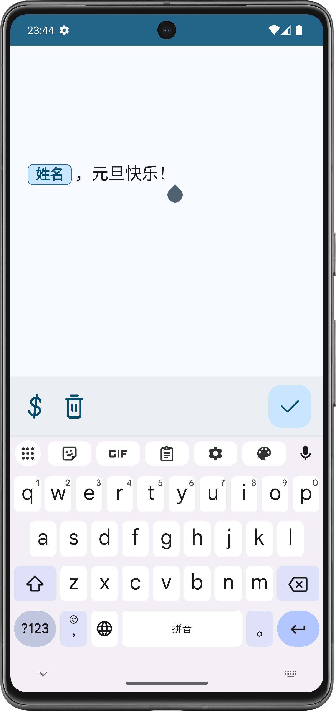
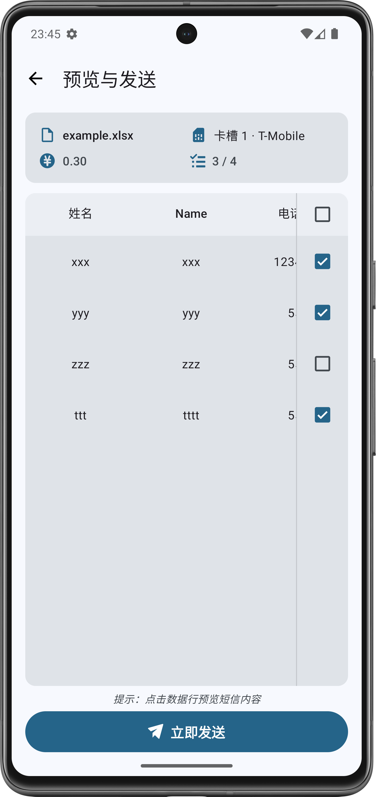
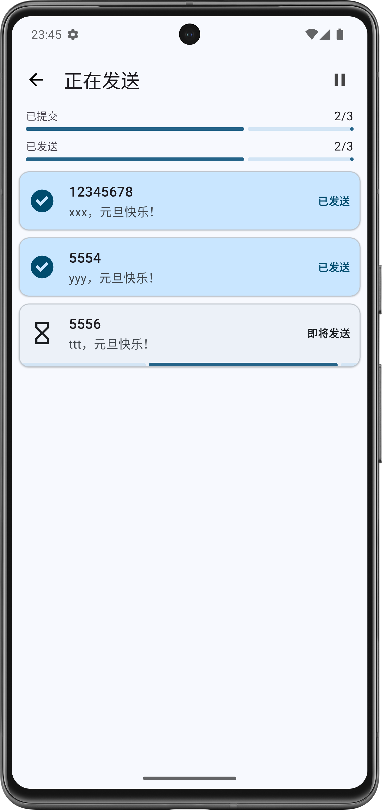

# MsgGo

安卓平台上的一款轻量的短信群发App。

[中文](./README.md) | [English](./README_EN.md)

> [!IMPORTANT]
> 本软件所提供的群发功能系基于手机系统原生的短信接口实现。
> 1. 本软件不提供任何中转分发服务，发送行为直接关联您的SIM卡号码，属于您的个人通信范畴。
> 2. 您的短信发送量、内容合规性及送达质量均受短信运营商的实时监控与限制。
> 3. 本软件无法干预运营商的审查机制及计费标准。用户应对其发送内容的合法性及由此产生的法律后果负全部责任。
> 4. 严禁利用本工具从事电信诈骗、垃圾信息传播等违法违规活动
> 5. 本软件仅限于个人或企业内部合规通讯使用，严禁用于商业营销及各类广告投递。如需开展营销业务，请咨询具备相关资质的专业短信服务供应商

## 更新

元旦快乐，第五个年头！元旦特别版更新，请大家下载体验！

---

距该项目发布已经将近 4 年了，本次更新带来了全新的外观材质（Material 3），更加优秀的交互，欢迎大家下载体验！

## Features

* [新] 历史记录功能
* [新] 短信资费计算
* [新] 短信发送预览
* [新] HyperOS支持
* [新] 多语言支持
* 支持多卡选择
* 无联网权限
* Material Design 3
* 基于excel数据格式导入
* 自动获取短信变量名
* 提供短信编辑器，支持短信[**魔法变量**](#魔法变量)代换
* 即时回馈信息发送状态
* 无需固定格式，App内指定号码列
* *第三方应用数据一键分享导入*

## 截图

## 下载

## 基本使用
1. 导入数据
2. 选择收件人号码列
3. 编辑短信内容
4. 选择 SIM 卡
5. 开始发送

> [!NOTE]  
> 1. 兼容.xls/.xlsx格式
> 2. 发送延迟不要过短，否则可能存在拦截问题。
> 3. 已知运营商一般存在发送限制，例如移动为200条/小时，1000条/天，超出后可能会被限制收发。

## Excel格式要求
| 列名  | 列名 | 列名 | ... |
|-----|----|----|-----|
| 数据  | 数据 | 数据 | ... |
| 数据  | 数据 | 数据 | ... |
| ... |    |    |     |

## 魔法变量

什么是魔法变量？

例如以下场景：

> 你要给多个人发送这样的短信：${xxx}同学，你好，balabala...

这里的`${xxx}`就是我们的魔法变量，在导入的excel中，每一个魔法变量对应的就是每一列，例如：

| 姓名 | 手机号码 |
|----|------|
| 张三 | 123  |
| 李四 | 456  |

那么这里就有两个魔法变量`姓名`与`手机号码`，在短信编辑界面中，只需要点击左下角的小按钮即可选择你需要的魔法变量，比如：

> ${姓名}，你好，你的手机号为${手机号码}

届时，软件将会自动根据每行记录来替换此变量：

| 姓名 | 手机号码 | 对应的短信内容         |
|----|------|-----------------|
| 张三 | 123  | 张三，你好，你的手机号为123 |
| 李四 | 456  | 李四，你好，你的手机号为456 |

如果帮助到您，请赐予一颗小星星吧:)  

## END

任何软件使用上的问题或者bug欢迎提交issue~

**郑重提醒：本项目仅供学习，切勿利用该软件传播违法骚扰内容，使用者行为以及目的与本人无关！**
