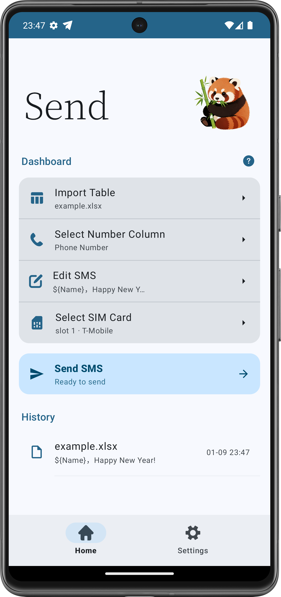
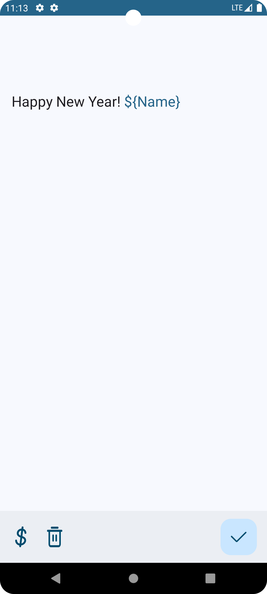
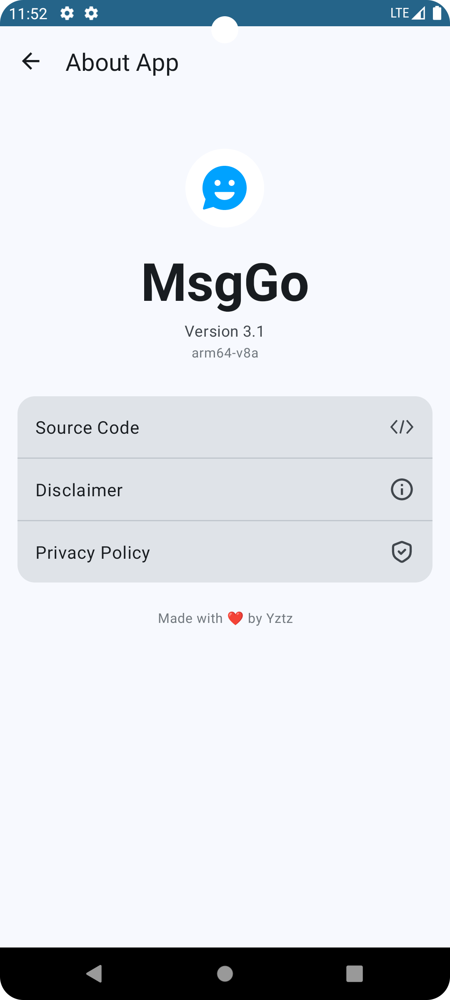
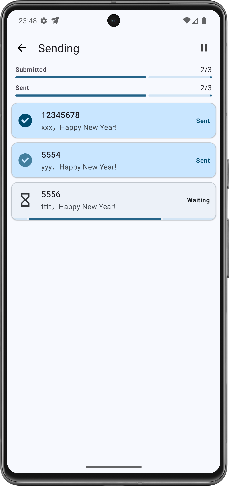

# MsgGo

A lightweight bulk SMS application for the Android platform.

[中文](./README.md) | [English](./README_EN.md)

> [!IMPORTANT]
> The bulk messaging functionality provided by this software is implemented based on the mobile device's native system SMS interface.
>
> 1. This software does not provide any third-party relay or distribution services. All transmission activities are directly associated with your SIM card number and are legally recognized as your personal communication.
> 2. The volume of messages sent, content compliance, and delivery rates are subject to real-time monitoring and restrictions imposed by your mobile network operator.
> 3. This software cannot intervene in the operator's filtering mechanisms or billing standards. Users shall bear full legal responsibility for the legality of the content sent and any resulting consequences.
> 4. It is strictly forbidden to use this tool for telecommunications fraud, the dissemination of spam, or any other illegal or non-compliant activities.
> 5. This software is strictly intended for personal or internal corporate communications. Use for commercial marketing or advertising distribution is strictly prohibited. For marketing-related services, please consult a qualified professional SMS service provider.

## Updates

Happy New Year! Entering our fifth year! The New Year Special Edition is now live—please download and enjoy!

---

It has been nearly 4 years since this project was launched. This update brings a brand-new look and feel (**Material 3**) and significantly improved interactions. Everyone is welcome to download and try it out!

## Features

* [New] History logs
* [New] SMS cost estimation
* [New] SMS preview before sending
* [New] HyperOS support
* [New] Multi-language support
* Dual-SIM selection support
* **No internet permission required**
* Material Design 3
* Import based on Excel data format
* Automatic retrieval of SMS variable names
* Built-in SMS editor with support for [**Magic Variables**](#magic-variables)
* Real-time feedback on message sending status
* No fixed template required; specify the phone number column within the app
* *One-click data sharing/import from third-party apps*

## Screenshots

## Download

## Basic Usage

1. Import data
2. Select the recipient phone number column
3. Edit SMS content
4. Select SIM card
5. Start sending

> [!NOTE]  
> 1. Compatible with .xls/.xlsx formats
> 2. Do not set the sending delay too short, or you may encounter carrier blocking issues.
> 3. Please be aware that carriers usually impose sending limits. For example, some carriers limit users to 200 messages/hour and 1,000 messages/day. Exceeding these limits may result in restricted sending/receiving capabilities.

## Excel Format Requirements

| Column Name | Column Name | Column Name | ... |
|-------------|-------------|-------------|-----|
| Data        | Data        | Data        | ... |
| Data        | Data        | Data        | ... |
| ...         |             |             |     |

## Magic Variables

What are Magic Variables?

Consider the following scenario:

> You want to send a message to multiple people: Dear ${xxx}, hello, balabala...

Here, `${xxx}` is our Magic Variable. In the imported Excel file, each magic variable corresponds to a column. For example:

| Name | Phone Number |
|------|--------------|
| John | 123          |
| Mike | 456          |

In this case, there are two magic variables: `Name` and `Phone Number`. In the SMS editor, simply click the small button in the bottom left corner to select the variable you need, such as:

> Hello ${Name}, your phone number is ${Phone Number}

The software will automatically replace the variables based on each row of data:

| Name | Phone Number | Resulting SMS Content                |
|------|--------------|--------------------------------------|
| John | 123          | Hello John, your phone number is 123 |
| Mike | 456          | Hello Mike, your phone number is 456 |

If this app helps you, please give it a star! :)

## END

If you encounter any issues or bugs while using the software, feel free to submit an issue.

**Solemn Reminder: This project is for educational purposes only. Do not use this software to spread illegal or harassing content. The actions and intentions of the users are independent of the developer!**